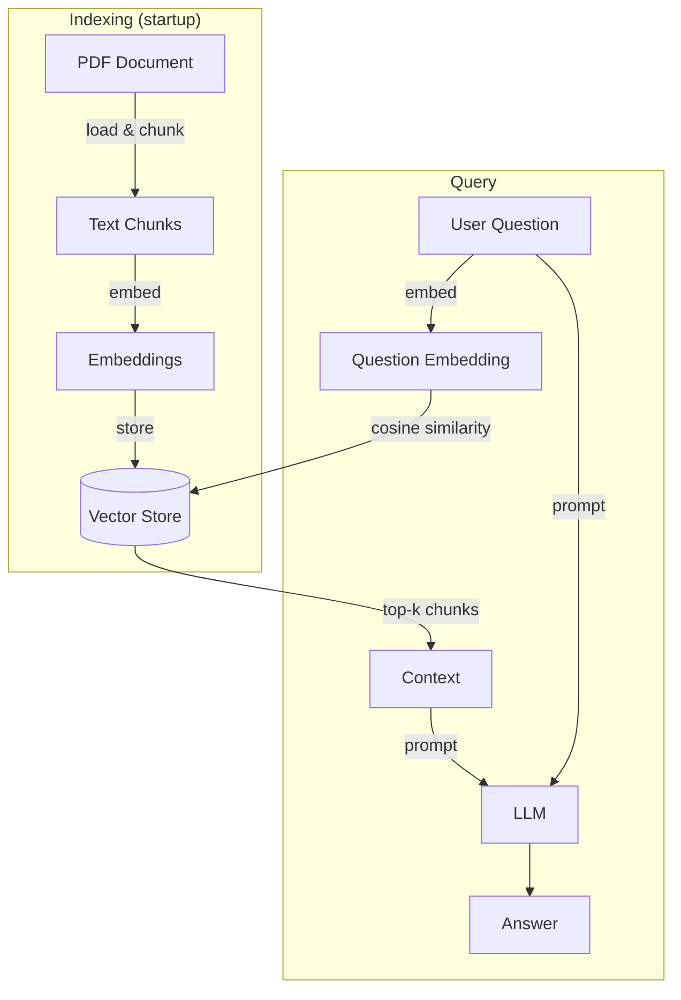

# Internal Policy RAG

This project uses a Retrieval-Augmented Generation (RAG) approach to query and extract information from TechSolutions S.L.'s internal policy document.

## Features

- Retrieval-Augmented Generation (RAG) over internal documents
- Clean Architecture with clear separation of concerns
- Pluggable vector store (Chroma / in-memory)
- REST API with FastAPI
- Automated evaluation pipeline (LLM-as-judge)
- Simple UI for interaction

## Screenshot


## RAG Flow



## Architecture

The project follows **Clean Architecture**.

```
app/
├── api/             # Entry point
├── domain/          # Core business
│   ├── models/
│   ├── repositories/
│   ├── services/
│   └── usecases/
├── data/            # Repository & datasource implementations
│   ├── datasources/
│   └── repositories/
├── infrastructure/  # External service implementations
└── di/              # Dependency injection container
```

### Domain layer (`app/domain/`)

The heart of the application. Contains no external dependencies — only pure Python and abstract interfaces.

- **Models** — Core data structures (e.g. `TextEmbedding`).
- **Repository interfaces** — Abstract contracts for data access (`DocumentRepository`, `VectorStoreRepository`). The domain defines *what* it needs, not *how* it is implemented.
- **Service interfaces** — Abstract contracts for external capabilities (`EmbeddingService`, `LLMService`, `TextChunker`).
- **Use cases** — Orchestrate the business logic:
  - `LoadInitialDataUseCase` — Reads source documents, splits them into chunks, generates embeddings, and stores them in the vector store.
  - `AskQuestionUseCase` — Embeds the user's question, retrieves the most similar document chunks from the vector store, and sends them as context to the LLM to produce a grounded answer.

### Data layer (`app/data/`)

Implements the repository interfaces defined in the domain.

- **Datasources** — Low-level I/O abstractions:
  - `DocumentLocalFileDatasource` — Reads PDF documents from the local filesystem.
  - `ChromaVectorStore` — Persists embeddings and documents to disk using [Chroma](https://www.trychroma.com/), with cosine similarity as the distance metric. The store survives server restarts, so documents are only indexed once.
  - `InMemoryVectorStore` — Alternative in-memory implementation using NumPy cosine similarity. Useful for testing or lightweight setups where persistence is not needed.
- **Repositories** — Implement the domain repository interfaces by composing one or more datasources (`DocumentRepositoryImpl`, `VectorStoreRepositoryImpl`).

### Infrastructure layer (`app/infrastructure/`)

Implements the service interfaces defined in the domain using third-party libraries and external APIs.

- `OpenAIEmbeddingService` — Calls the OpenAI Embeddings API (`text-embedding-3-small`) to convert text into vector representations.
- `OpenAILLMService` — Calls the OpenAI Chat Completions API to generate answers given a question and retrieved context.
- `ManualTextChunker` — Splits raw document text into smaller chunks suitable for embedding and retrieval.

### API layer (`app/api/`)

The outermost layer. Exposes the application over HTTP using **FastAPI**.

- On startup, triggers `LoadInitialDataUseCase` to index the documents.
- `POST /ask?question=...` — Delegates to `AskQuestionUseCase` and returns the answer.

### Dependency injection (`app/di/`)

The `Container` class wires together all concrete implementations and injects them into use cases. This is the only place in the codebase where concrete classes are instantiated and assembled, keeping every other layer decoupled.

## Tech stack

| Concern | Library |
| --- | --- |
| REST API | FastAPI + Uvicorn |
| LLM & Embeddings | OpenAI API |
| PDF parsing | pypdf |
| Vector store | Chroma (persistent, cosine similarity) |
| Vector similarity | NumPy (in-memory) |
| Testing | pytest + pytest-asyncio |

## Setup

1. Clone the repository and navigate into it


2. Create and activate a virtual environment:
   ```bash
   # macOS / Linux
   python3 -m venv .venv
   source .venv/bin/activate

   # Windows
   python -m venv .venv
   .venv\Scripts\activate
   ```

3. Install dependencies:
   ```bash
   pip install -r requirements.txt
   ```

4. Create a `.env` file with your OpenAI API key:
   ```
   OPENAI_API_KEY=your_key_here
   ```

5. Run the server:
   ```bash
   fastapi dev app/api/main.py
   ```

6. Open `http://localhost:8000` in your browser and ask a question. Some examples:
   - Can I use software for personal purposes?
   - How many vacation days do I have?

## Running tests

```bash
pytest
```

## Evaluation

The `eval/` folder contains a script that measures the quality of the RAG pipeline using an **LLM-as-judge** approach.

For each test case in `eval/test_cases.json`, the script:
1. Runs the question through the pipeline
2. Asks `gpt-4o-mini` to score the actual answer against the expected answer (1 = FAIL, 2 = PARTIAL, 3 = PASS)
3. Prints a report with the result and reason for each question

To run:
```bash
PYTHONPATH=. python eval/run_eval.py
```

Example result:
```
Average score: 2.6/3.0 (5 questions)
```

**Key insight:** The evaluation revealed a failure case where the system returned an empty answer despite relevant information existing in the document. This highlights:

- The importance of retrieval quality (top-k, thresholds)
- The value of automated evaluation in identifying edge cases
